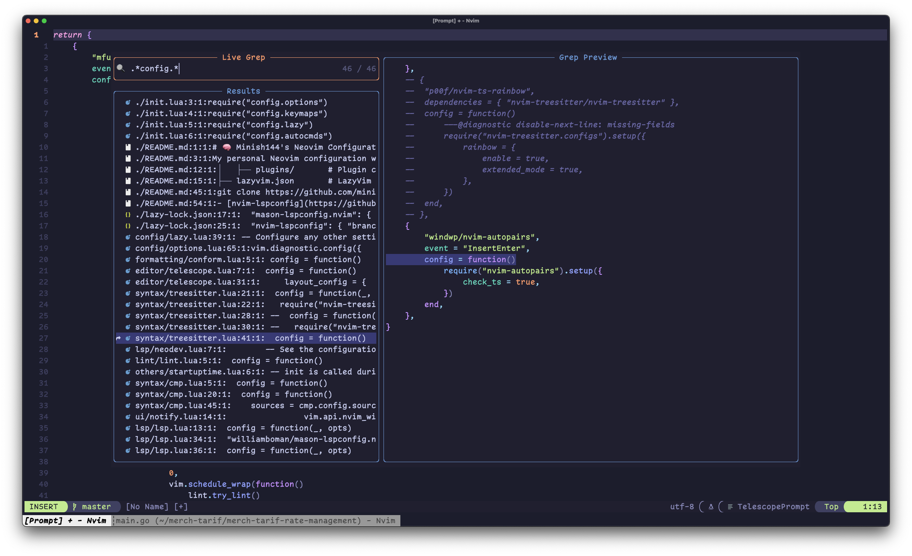
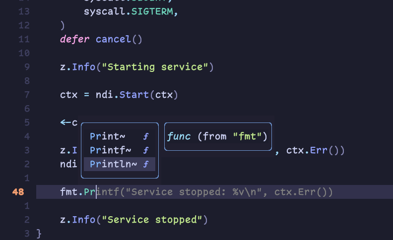

# 🧠 Minish144's Neovim Configuration

My personal Neovim configuration written in Lua, using [lazy.nvim](https://github.com/folke/lazy.nvim) as the plugin manager.

## 📁 Project Structure

```bash
nvim/
├── init.lua
├── lua/
│   ├── core/          # Core settings and modules
│   ├── plugins/       # Plugin configurations
│   └── utils/         # Utility functions
├── lazy-lock.json     # Lock file for lazy.nvim
├── lazyvim.json       # LazyVim configuration
├── .env.example       # Example environment file
└── .gitignore         # Git ignored files
```

## 🚀 Key Features

- ⚡ Fast and minimal setup with `lazy.nvim`
- 🧩 LSP support, autocompletion, and code formatting
- 🔍 Integration with `telescope.nvim` for file and text search
- 🎨 Theming and UI enhancements for a better experience
- 🛠️ Easily customizable and extendable

## 🖼️ Screenshots

> 📸 **Main Neovim interface**  
> 

> 🔍 **File search with Telescope**  
> 

> 🧠 **LSP and autocompletion**  
> 

## ⚙️ Installation

```bash
rm -rf ~/.local/share/nvim
rm -rf ~/.local/state/nvim
rm -rf ~/.cache/nvim
git clone https://github.com/minish144/nvim ~/.config/nvim
```

On first launch, `lazy.nvim` will automatically install all required plugins. 
Then execute `:UpdateRemotePlugins` in Neovim to enable defx

## 📦 Some of included Plugins

- [lazy.nvim](https://github.com/folke/lazy.nvim) — plugin manager
- [nvim-lspconfig](https://github.com/neovim/nvim-lspconfig) — LSP configuration
- [telescope.nvim](https://github.com/nvim-telescope/telescope.nvim) — fuzzy file and text search
- [nvim-cmp](https://github.com/hrsh7th/nvim-cmp) — autocompletion
- [LuaSnip](https://github.com/L3MON4D3/LuaSnip) — snippet engine
- [gitsigns.nvim](https://github.com/lewis6991/gitsigns.nvim) — Git integration
- [tokyonight.nvim](https://github.com/folke/tokyonight.nvim) — color scheme

## 🧰 Requirements

- Neovim >= 0.11
- Installed tools: `ripgrep`, `fd`, `git`
- Some LSPs may require: `npm`, `go`, `python`

## 🤝 Contact

If you have questions or suggestions, feel free to open an [Issue](https://github.com/minish144/nvim/issues) in the repository.

