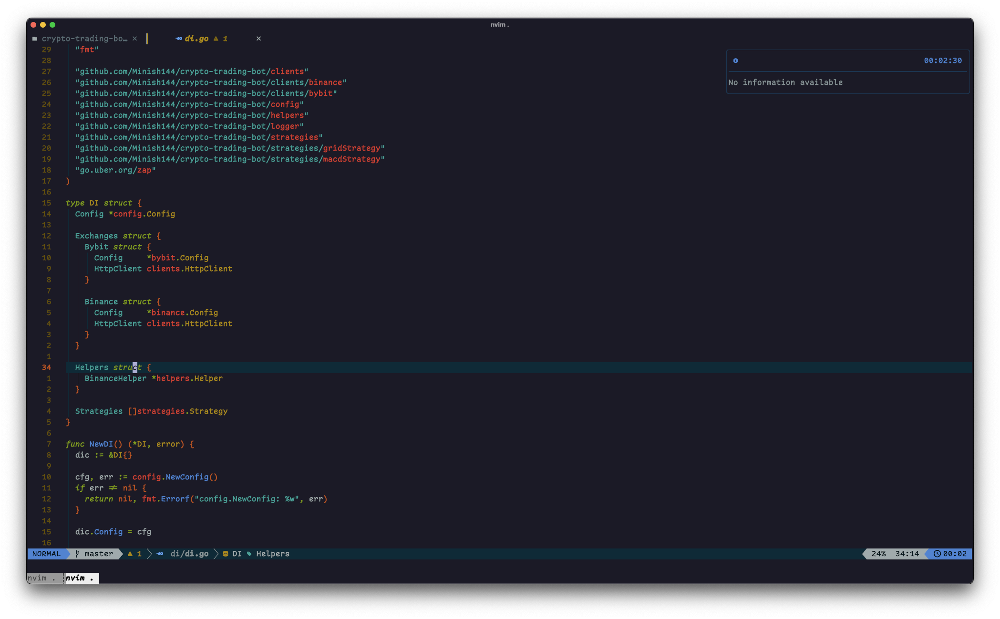

<h1>My NeoVim Configuration</h1>

<h2>About</h2>
This repo is my neovim confuguration using Lua and made mostly for golang development

<h2>Requirements</h2>
<ol>
    <li><a href="https://neovim.io/">NeoVim</a> - vim based text editor</li>
    <li><a href="https://www.nerdfonts.com/">Nerd Font</a> - any font with icons support</li>
</ol>

<h2>Installation</h2>
<ol>
    <li>Clonse this repo to your nvim config path: <code>git clone https://github.com/Minish144/nvim.git ~/nvim</code></li>
    <li>Open nvim and run command <code>:PackerSync` to install plugins</code></li>
</ol>

<h2>Plugins</h2>
<table>
    <th>Stars</th><th>Plugin</th><th>Description</th>
    <tr>
        <td></td>
        <td><a href="https://github.com/neoclide/coc.nvim">Packer</a></td>
        <td>Plugin manager</td>
    </tr>
    <tr>
        <td></td>
        <td><a href="https://github.com/ryanoasis/vim-devicons">Vim Dev Icons</a></td>
        <td>Adds file type icons to Vim</td>
    </tr>
    <tr>
        <td></td>
        <td><a href="https://github.com/kyazdani42/nvim-web-devicons">Nvim Web Dev Icons</a></td>
        <td>Lua fork of vim-web-devicons for neovim</td>
    </tr>
    <tr>
        <td></td>
        <td><a href="https://github.com/nvim-lua/plenary.nvim">Plenary</a></td>
        <td>All the lua functions you don't want to write twice</td>
    </tr>
    <tr>
        <td></td>
        <td><a href="https://github.com/MunifTanjim/nui.nvim">NUI</a></td>
        <td>UI Component Library</td>
    </tr>
    <tr>
        <td></td>
        <td><a href="https://github.com/rrethy/vim-illuminate">Illuminate</a></td>
        <td>Highlights other uses in file of word under cursor</td>
    </tr>
    <tr>
        <td></td>
        <td><a href="https://github.com/lewis6991/impatient.nvim">Impatient</a></td>
        <td>Speeds up loading lua modules</td>
    </tr>
    <tr>
        <td></td>
        <td><a href="https://github.com/nvim-treesitter/nvim-treesitter">TreeSitter</a></td>
        <td>Parsing system for programming tools</td>
    </tr>
    <tr>
        <td></td>
        <td><a href="https://github.com/lewis6991/impatient.nvim">Comment</a></td>
        <td>Comment plugin</td>
    </tr>
    <tr>
        <td></td>
        <td><a href="https://github.com/folke/which-key.nvim">Which-Key</a></td>
        <td>Keymaps pop-up</td>
    </tr>
    <tr>
        <td></td>
        <td><a href="https://github.com/bronson/vim-trailing-whitespace">Trailing Whitespace</a></td>
        <td>Highlights trailing whitespaces</td>
    </tr>
    <tr>
        <td></td>
        <td><a href="https://github.com/nestorsalceda/vim-strip-trailing-whitespaces">Strip Trailing Whitespaces</a></td>
        <td>Removes trailing whitespaces on save</td>
    </tr>
    <tr>
        <td></td>
        <td><a href="https://github.com/akinsho/bufferline.nvim">Bufferline</a></td>
        <td>IDE-like tabs</td>
    </tr>
    <tr>
        <td></td>
        <td><a href="https://github.com/jiangmiao/auto-pairs">Auto Pairs</a></td>
        <td>Auto closing pairing brackets and braces</td>
    </tr>
        <tr>
        <td></td>
        <td><a href="https://github.com/neoclide/coc.nvim">COC</a></td>
        <td>Load extensions like VSCode and host language servers.</td>
    </tr>
        <tr>
        <td></td>
        <td><a href="https://github.com/lewis6991/gitsigns.nvim">Git Signs</a></td>
        <td>Git integration</td>
    </tr>
    </tr>
        <tr>
        <td></td>
        <td><a href="https://github.com/tpope/vim-fugitive">Fugitive</a></td>
        <td>Git integration</td>
    </tr>
    </tr>
        <tr>
        <td></td>
        <td><a href="https://github.com/nvim-lualine/lualine.nvim">Lualine</a></td>
        <td>Bottom status line</td>
    </tr>
    </tr>
        <tr>
        <td></td>
        <td><a href="https://github.com/norcalli/nvim-colorizer.lua">Colorizer</a></td>
        <td>Colors highliting in code</td>
    </tr>
    </tr>
        <tr>
        <td></td>
        <td><a href="https://github.com/junegunn/fzf">FZF</a></td>
        <td>Command-line fuzzy finder</td>
    </tr>
</table>

<h2>Coc Extensions</h2>
<ul>
    <li><a href="https://github.com/josa42/coc-go">Go</a> - go language server extension using gopls</li>
    <li><a href="https://github.com/fannheyward/coc-pyright">Pyright</a> - python extension</li>
    <li><a href="https://github.com/weirongxu/coc-explorer">Explorer</a> - tree explorer</li>
    <li><a href="https://github.com/neoclide/coc-json">JSON</a> - json language extension</li>
    <li><a href="https://github.com/weirongxu/coc-webview">WebView</a> - using an external browser to support the webview</li>
    <li><a href="https://github.com/weirongxu/coc-markdown-preview-enhanced">Markdown Preview Enchanced</a> - markdown live preview using coc-webview</li>
</ul>

<h2>Colorscheme</h2>
<ul>
    <li><a href="https://github.com/ghifarit53/tokyonight-vim">Tokyo Night</a> - a clean, dark vim colorscheme that
    celebrates the lights of downtown Tokyo at night, based on a VSCode theme</li>
</ul>

<h2>Associated</h2>
<ul>
    <li>Terminal app - <a>Kitty</a> (<a href="https://github.com/Minish144/dotfiles/blob/master/kitty/kitty.conf">config</a>)</li>
    <li>Terminal font - <a href="https://tosche.net/jp/fonts/comic-code">Comic Code Ligatures</a> patched with <a href="https://github.com/ryanoasis/nerd-fonts#font-patcher">Nerd Fonts Patcher</a></li>
    <li>Shell - zsh  with <a href="https://ohmyz.sh">oh-my-zsh</a> (<a href="https://github.com/Minish144/dotfiles/blob/master/zsh/.zshrc">config</a>)</li>
</ul>
