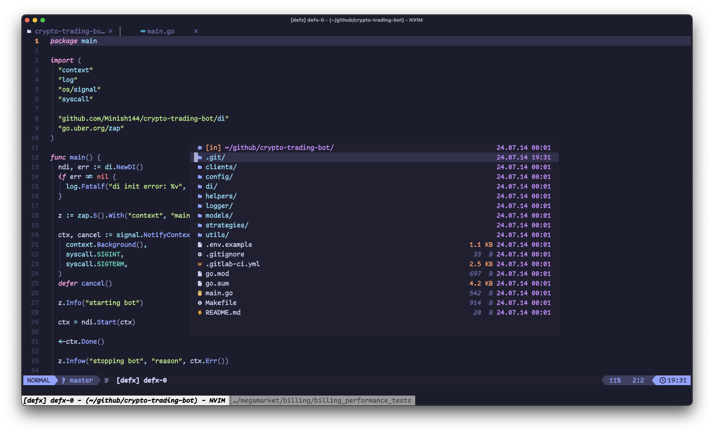

<h1>My NeoVim Configuration</h1>

<h2>About</h2>
This repo is my neovim confuguration using Lua and made mostly for golang development

<h2>Requirements</h2>
<ol>
    <li><a href="https://neovim.io/">NeoVim</a> - vim based text editor</li>
    <li><a href="https://www.nerdfonts.com/">Nerd Font</a> - any font with icons support</li>
</ol>

<h2>Installation</h2>
<ul>
    <li>Clonse this repo to your nvim config path: `git clone https://github.com/Minish144/nvim.git ~/nvim`</li>
    <li>Open nvim and run command `:PackerSync` to install plugins</li>
<ul>

<h2>Plugins</h2>
<table>
    <th>Stars</th><th>Plugin</th><th>Description</th>
    <tr>
        <td></td>
        <td><a href="https://github.com/neoclide/coc.nvim">Packer</a></td>
        <td>Test</td>
    </tr>
    <tr>
        <td></td>
        <td><a href="https://github.com/ryanoasis/vim-devicons">Vim Dev Icons</a></td>
        <td>Adds file type icons to Vim</td>
    </tr>
    <tr>
        <td></td>
        <td><a href="https://github.com/kyazdani42/nvim-web-devicons">Nvim Web Dev Icons</a></td>
        <td>Lua fork of vim-web-devicons for neovim</td>
    </tr>
    <tr>
        <td></td>
        <td><a href="https://github.com/nvim-lua/plenary.nvim">Plenary</a></td>
        <td>All the lua functions you don't want to write twice</td>
    </tr>
    <tr>
        <td></td>
        <td><a href="https://github.com/MunifTanjim/nui.nvim">NUI</a></td>
        <td>UI Component Library</td>
    </tr>
    <tr>
        <td></td>
        <td><a href="https://github.com/rrethy/vim-illuminate">Illuminate</a></td>
        <td>Highlights other uses in file of word under cursor</td>
    </tr>
    <tr>
        <td></td>
        <td><a href="https://github.com/lewis6991/impatient.nvim">Impatient</a></td>
        <td>Speeds up loading lua modules</td>
    </tr>
    <tr>
        <td></td>
        <td><a href="https://github.com/nvim-treesitter/nvim-treesitter">TreeSitter</a></td>
        <td>Parsing system for programming tools</td>
    </tr>
    <tr>
        <td></td>
        <td><a href="https://github.com/lewis6991/impatient.nvim">Comment</a></td>
        <td>Comment plugin</td>
    </tr>
    <tr>
        <td></td>
        <td><a href="https://github.com/folke/which-key.nvim">Which-Key</a></td>
        <td>Keymaps pop-up</td>
    </tr>
</table>

### Coc Extensions

